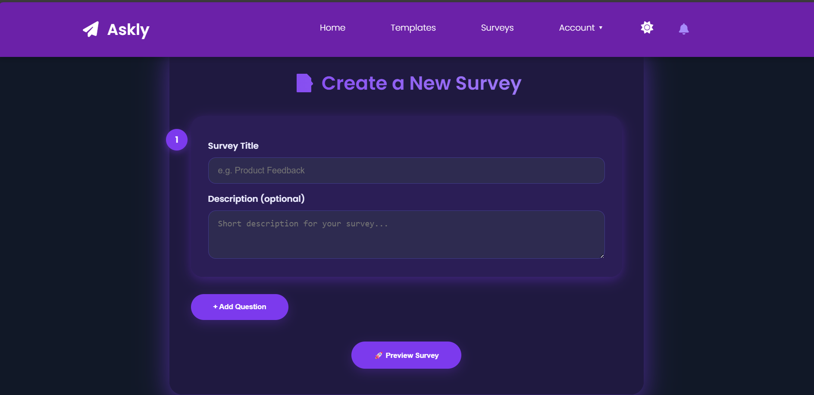
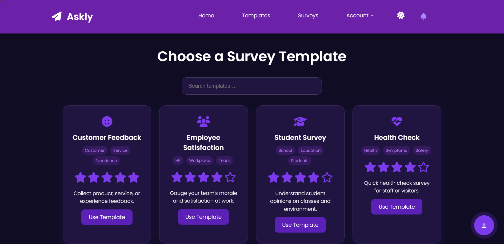
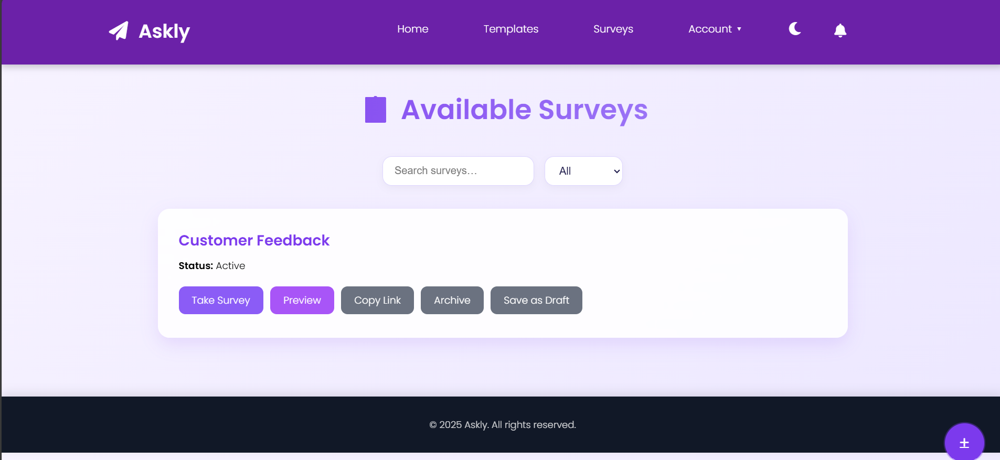
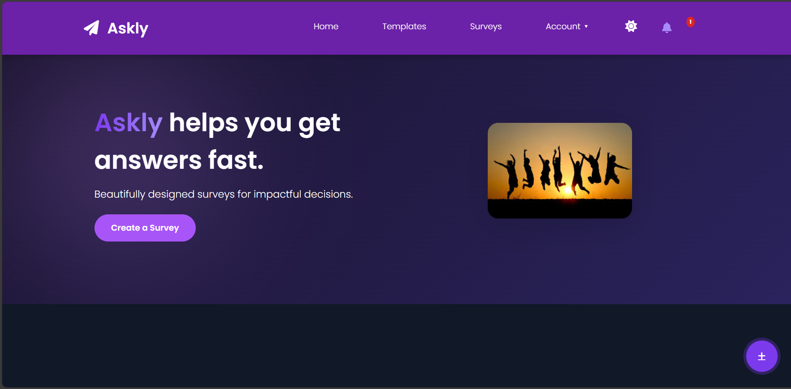
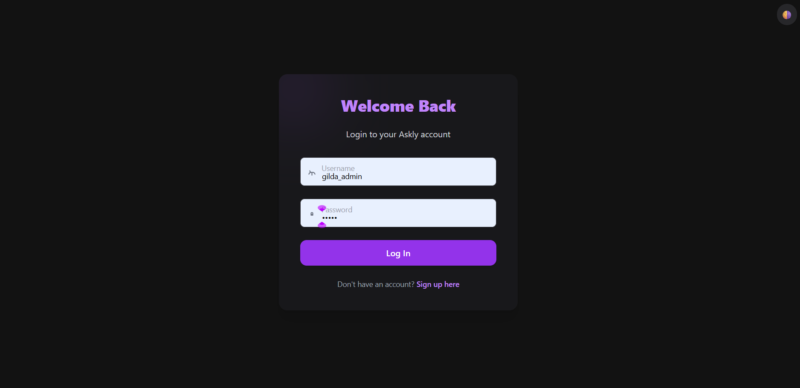
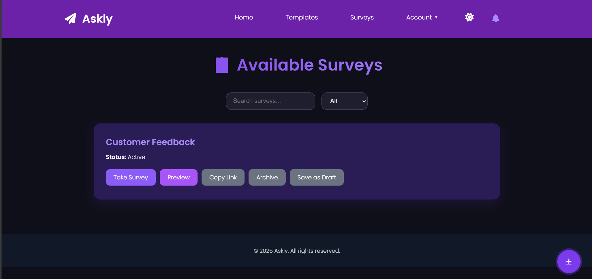
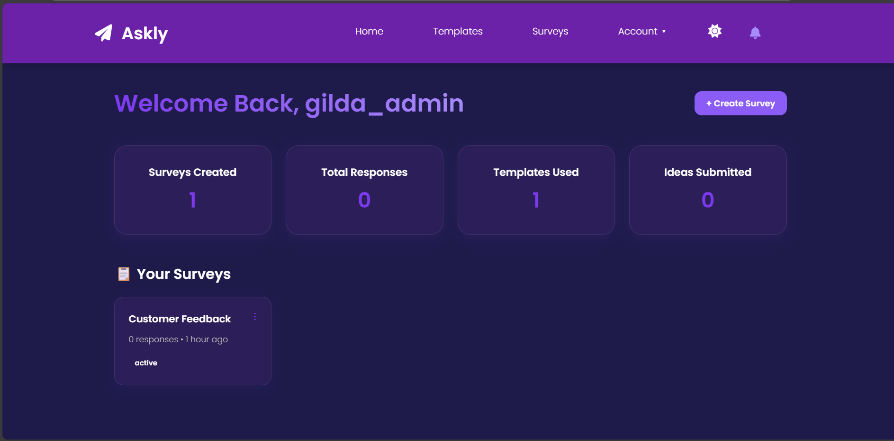
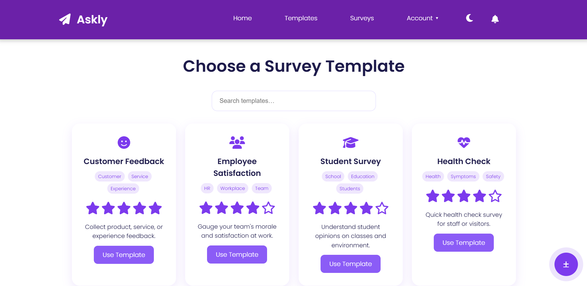
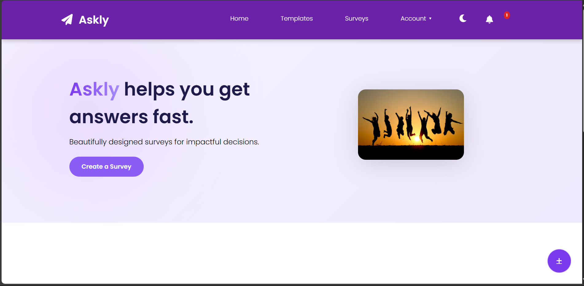

# 🗳️ Askly – Cloud-Native Survey Platform

**Askly** is a customizable, containerized survey platform built with Django, PostgreSQL, and Docker. It helps you create and manage surveys, collect responses, and visualize insights—all while being cloud-ready and scalable. Designed as a learning project for aspiring cloud architects, Askly combines technical precision with creative storytelling. Also, Askly embraces a sleek and modern aesthetic with a glassy purple color palette—balancing elegance with tech minimalism.

 








 <!-- optional banner -->

---

## 🌟 Features

- ✍️ Create multiple surveys via admin dashboard
- ✅ Submit responses from public forms
- 🔒 User authentication built-in
- 🧠 PostgreSQL-powered backend
- 🐳 Docker + Docker Compose for local and cloud deployment
- 📦 Organized folder structure for maintainability
- 🌐 Mobile-accessible with real-time feedback planned

---

## 🌍 How Askly Works – Functionality & Page Flow

Askly provides a smooth workflow for creating, distributing, and viewing survey results:

### 🏠 Homepage
- Welcome page with call-to-action and optional branding
- Navigation to available surveys or login/signup

### 📋 Survey List
- Publicly accessible list of live surveys
- Allows filtering and searching (enhancements planned)

### 📝 Survey Submission
- Respondents answer questions and submit feedback
- Confirmation message upon completion

### 🎛️ Admin Dashboard
- Accessible at `/admin` by superusers
- Create, edit, archive surveys
- View results and manage submissions

### ⚙️ Developer Utilities
- Environment-based config via `.env`
- Live editing support via Docker volume mounts
- Django shell access for data manipulation

---

## 🛠️ Tech Stack

| Layer            | Tools Used                  |
|------------------|-----------------------------|
| Backend          | Django 5.2.2                 |
| Database         | PostgreSQL 15               |
| Containerization | Docker & Docker Compose     |
| Config           | `.env` file with variable injection |
| Deployment Ready | Cloud platforms (Render, Railway, AWS, Azure) |
| Styling          | HTML, CSS (Static files)    |

---

## 📁 Project Structure

```bash
ASKLY/
├── askly/             # Django settings, URLs
├── surveys/           # Core app logic
├── templates/         # HTML templates
├── static/            # CSS/JS/images
├── assets/            # Screenshots, visuals for README
├── Dockerfile         # App container setup
├── docker-compose.yml # Multi-service launcher
├── requirements.txt   # Project dependencies
├── .env.example       # Sample config (no secrets)
├── manage.py          # Django entry point
└── README.md          # This file!
